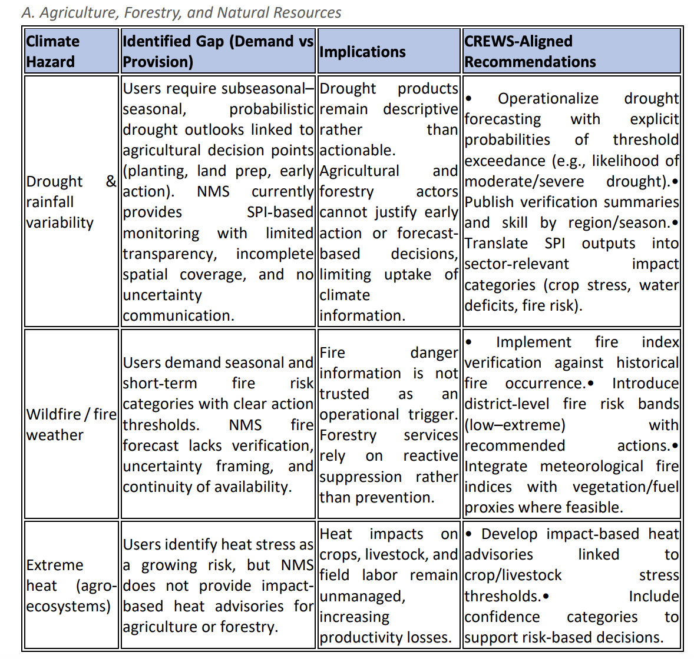
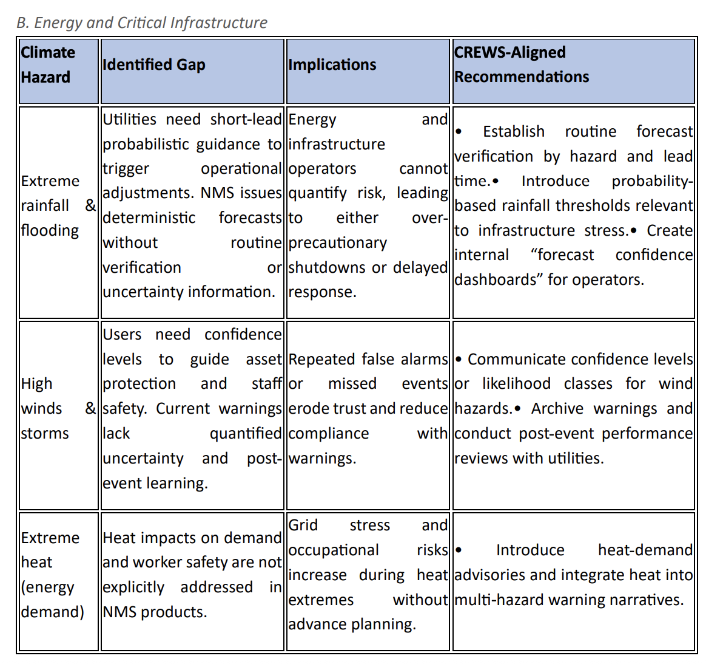
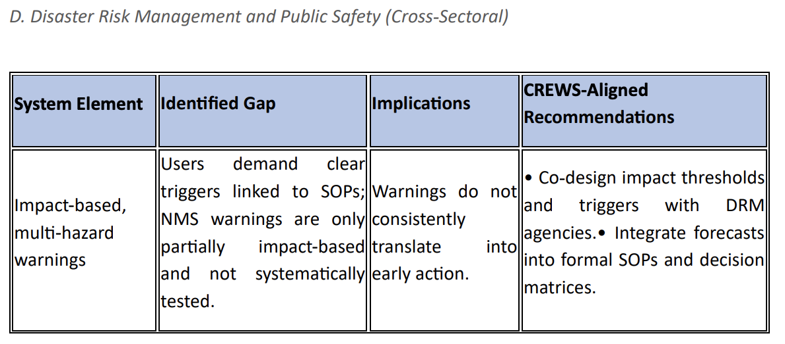

# Your Feedback

Now it's your turn to provide feedback. Having seen a sample of what the NMS, Columbia and WFP have been working on, we now ask for your input to complete the process. Building on the feedback you have already provided, we will ask you to share some information on the climate impact events your sector has experienced, the information you could have used to anticipate them, and the anticipatory actions you would have taken as a result. 

Currently implemented Maptools:

- DROUGHT: https://ee-maxmauerman.projects.earthengine.app/view/belizedrought 
- FLOOD / EXCESS: https://ee-maxmauerman.projects.earthengine.app/view/belizeflood 
- HEAT: https://ee-maxmauerman.projects.earthengine.app/view/belizeheat 
- STORMS: https://ee-maxmauerman.projects.earthengine.app/view/belizestorms 
- WILDFIRES: https://ee-maxmauerman.projects.earthengine.app/view/belizewildfires 

## User Needs

Based on previous forecast user need assessments from the Climate Risk Early Warning System (CREWS) project, key needs in Belize include:

## Capturing Feedback

For this exercise, we will ask you to break into small groups based on your sector, and discuss your answer together. 

 

